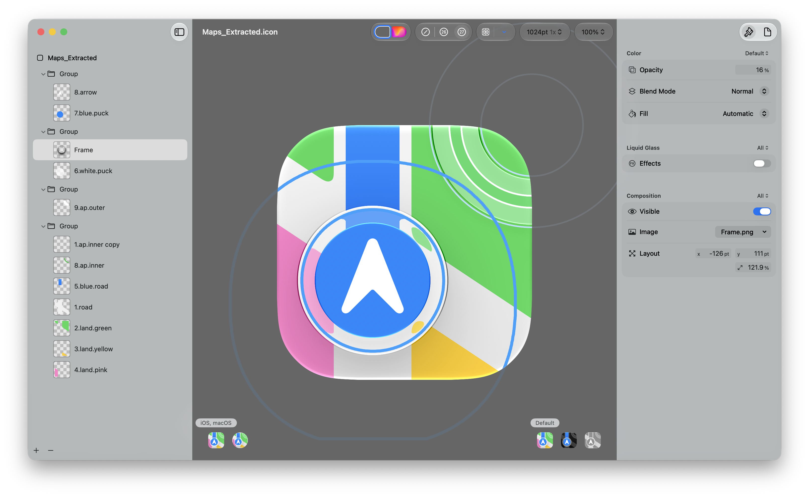
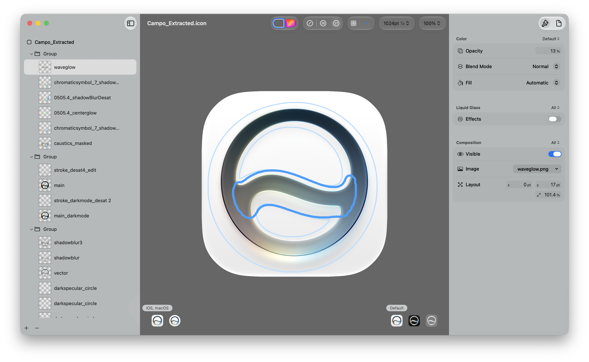

# macOS 27 System Icons

A collection of macOS 27 system application icons extracted from local system apps.

The icons in this repository were extracted with [Clayton630/Mac-Icon-Extracor](https://github.com/Clayton630/Mac-Icon-Extracor). They are provided for reference, learning, and comparison purposes.

> Note: the `.icon` files are extracted results and may not be perfectly accurate reconstructions of the original Icon Composer sources.

## Preview

  <h3>App Store</h3>
  

  <h3>Maps</h3>
  

  <h3>Siri</h3>
  

## Contents

- `Application Icons/`: extracted `.icon` files for macOS system applications.
- `assets/`: preview images used by this README.

This repository currently includes 49 extracted system application icons.

## Disclaimer

These icons are extracted from macOS system applications. The icons, app names, and related visual assets belong to Apple and their respective rights holders. This repository is not affiliated with or endorsed by Apple.

Because the files are reconstructed from extracted app resources, layer positions, effects, materials, or metadata may differ from the original source files.
